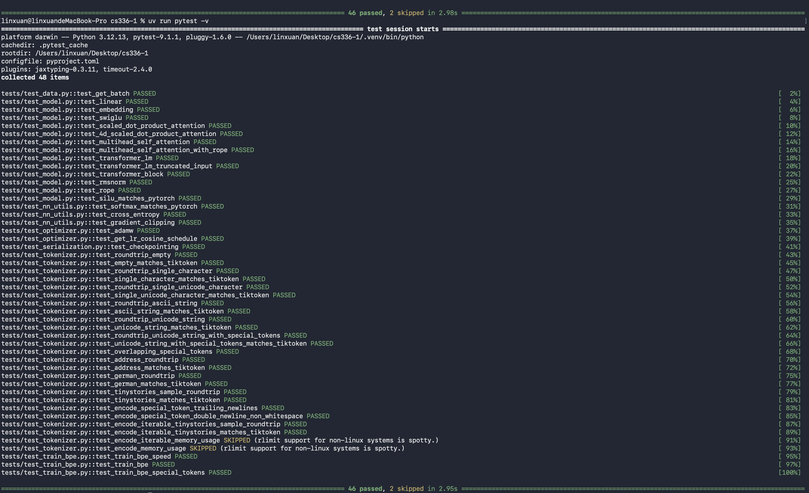
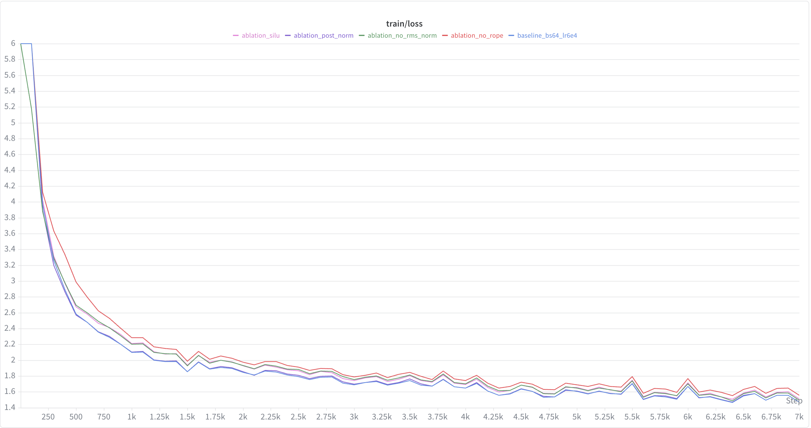
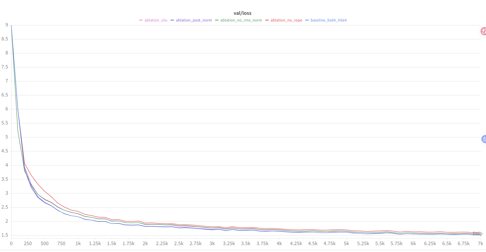

# CS336 Assignment 1 ：从零实现 Decoder-only Transformer 及消融实验
## 项目简介

本项目基于 Stanford CS336 Assignment 1，从底层实现了一个完整的 Transformer 语言模型训练系统，包括：

- BPE Tokenizer
- Transformer Block
- Multi-Head Causal Self-Attention
- Rotary Positional Embedding（RoPE）
- RMSNorm
- SwiGLU
- Cross-Entropy Loss
- AdamW Optimizer
- Warmup + Cosine Learning Rate Scheduler
- Gradient Clipping
- Checkpoint 保存与恢复
- W&B 训练监控
- Temperature 与 Top-p 文本生成

模型使用 TinyStories 数据集训练，并在 RTX 5090 D 32 GB GPU 上完成 baseline 和四组架构消融实验。

## 测试

```
uv run pytest -v
```



## 准备工作

```
uv run wandb login
```

输入 wandb api key 后
```
tmux new -s cs336
```

离开 按 Ctrl+B 松开按 D

重新进入：

```
tmux attach -t cs336
```

## 实验

benchmark 测速

```
time uv run python -m cs336_basics.main_train \
  --train_data_path data/TinyStoriesV2-GPT4-train.bin \
  --valid_data_path data/TinyStoriesV2-GPT4-valid.bin \
  --vocab_size 10000 \
  --context_length 256 \
  --d_model 512 \
  --num_layers 4 \
  --num_heads 16 \
  --d_ff 1344 \
  --batch_size 64 \
  --max_iters 200 \
  --warmup_iters 20 \
  --log_interval 100 \
  --eval_iters 10 \
  --checkpoint_interval 200 \
  --out_dir model_result/benchmark \
  --device cuda \
  --wandb_project cs336-benchmark \
  --run_name benchmark-5090d-bs64 \
  --wandb_mode online \
  --no-resume
```

依次运行 baseline 和四组消融实验：
```
bash cs336_basics/run_scripts/baseline.sh
bash cs336_basics/run_scripts/no_rope.sh
bash cs336_basics/run_scripts/no_rms_norm.sh
bash cs336_basics/run_scripts/post_norm.sh
bash cs336_basics/run_scripts/silu.sh
```





# CS336 Spring 2025 Assignment 1: Basics

For a full description of the assignment, see the assignment handout at
[cs336_spring2025_assignment1_basics.pdf](./cs336_spring2025_assignment1_basics.pdf)

If you see any issues with the assignment handout or code, please feel free to
raise a GitHub issue or open a pull request with a fix.

## Setup

### Environment
We manage our environments with `uv` to ensure reproducibility, portability, and ease of use.
Install `uv` [here](https://github.com/astral-sh/uv) (recommended), or run `pip install uv`/`brew install uv`.
We recommend reading a bit about managing projects in `uv` [here](https://docs.astral.sh/uv/guides/projects/#managing-dependencies) (you will not regret it!).

You can now run any code in the repo using
```sh
uv run <python_file_path>
```
and the environment will be automatically solved and activated when necessary.

### Run unit tests


```sh
uv run pytest
```

Initially, all tests should fail with `NotImplementedError`s.
To connect your implementation to the tests, complete the
functions in [./tests/adapters.py](./tests/adapters.py).

### Download data
Download the TinyStories data and a subsample of OpenWebText

``` sh
mkdir -p data
cd data

wget https://huggingface.co/datasets/roneneldan/TinyStories/resolve/main/TinyStoriesV2-GPT4-train.txt
wget https://huggingface.co/datasets/roneneldan/TinyStories/resolve/main/TinyStoriesV2-GPT4-valid.txt

wget https://huggingface.co/datasets/stanford-cs336/owt-sample/resolve/main/owt_train.txt.gz
gunzip owt_train.txt.gz
wget https://huggingface.co/datasets/stanford-cs336/owt-sample/resolve/main/owt_valid.txt.gz
gunzip owt_valid.txt.gz

cd ..
```

